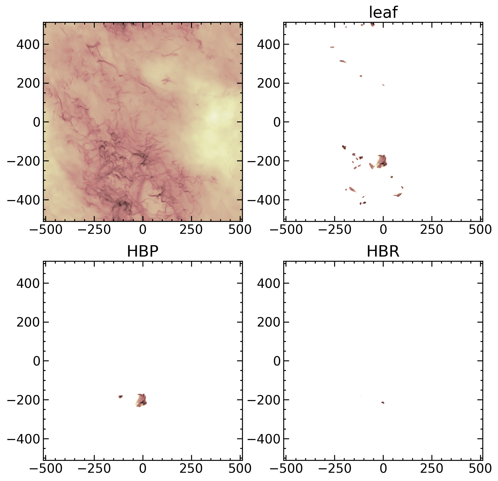

# GRID-Dendro -- Gravitational Identification with Dendrogram

[](https://sanghyukmoon.github.io/grid_dendro)


## Acknowledgments and Historical Remarks
{cite:t}`GongOstriker2011` developed and introduced a core finding method called GRID (GRavitatianal IDentification), which utilize isocontours of gravitational potential to provide physically motivated definition of bound cores. {cite:t}`Mao2020` extended this algorithm to identify hierarchical structures of the interstellar medium using dendrogram, as well as significantly improve the efficiency of the algorithm. Alwin Mao, who is the first author of {cite:t}`Mao2020`, wrote a python pacakge [FISO](https://github.com/alwinm/fiso) (fast isocontours) to implement this algorithm in the course of his PhD program. The code has an optimal performance thanks to Alwin's huge effort to make it fast. Because FISO is so good, I wanted to make it more user-friendly in terms of code design and documentation. Alwin kindly agreed that I can refactor the code and maintain it in a [separate repository](https://github.com/sanghyukmoon/grid_dendro).


## Example Usage
```
>>> import matplotlib.pyplot as plt
>>> from matplotlib.colors import LogNorm
>>> from pathlib import Path
>>> import pyathena as pa
>>> from grid_dendro import dendrogram
>>> from grid_dendro import energy
>>>
>>> basedir = Path("/tigress/sm69/public_html/files/grid_dendro_example_data")
>>> ds = pa.read_vtk(basedir / "R8_4pc.0500.vtk")
>>> ds_grav_pp = pa.read_vtk(basedir / "R8_4pc.0500.Phi.vtk")
>>> dat = ds.get_field(['density','velocity','pressure'])
>>> dat['gravitational_potential'] = ds_grav_pp.get_field('Phi').Phi
>>> dat = dat.sel(z=slice(-200, 200))
>>> gd = dendrogram.Dendrogram(dat.gravitational_potential.data)
>>> gd.construct()
>>> gd.prune()  # Remove buds
>>> data = dict(rho=dat.density.data,
                vel1=dat.velocity1.data,
                vel2=dat.velocity2.data,
                vel3=dat.velocity3.data,
                prs=dat.pressure.data,
                phi=dat.gravitational_potential.data)
>>> hbp, hbr = energy.find_bound_objects(gd, data)
>>>
>>> # Now, plot the results
>>> fig, axs = plt.subplots(2, 2, figsize=(10,10))
>>> dim = 'z'
>>> dz = ds.domain['dx'][2]
>>> 
>>> (dat.density).sum(dim=dim).plot.imshow(ax=axs[0,0], norm=LogNorm(1e0, 2e3),
>>>                                        cmap='pink_r', add_colorbar=False, add_labels=False)
>>> 
>>> rho = gd.filter_data(dat.density, gd.leaves)
>>> (rho*dz).sum(dim=dim).plot.imshow(ax=axs[0,1], norm=LogNorm(1e0, 2e3), cmap='pink_r',
>>>                                   add_colorbar=False, add_labels=False)
>>> axs[0,1].set_title("leaf")
>>> 
>>> rho = dendrogram.filter_by_node(dat.density, hbp)
>>> (rho*dz).sum(dim=dim).plot.imshow(ax=axs[1,0], norm=LogNorm(1e0, 2e3), cmap='pink_r',
>>>                                   add_colorbar=False, add_labels=False)
>>> axs[1,0].set_title("HBP")
>>> 
>>> rho = dendrogram.filter_by_node(dat.density, hbr)
>>> (rho*dz).sum(dim=dim).plot.imshow(ax=axs[1,1], norm=LogNorm(1e0, 2e3), cmap='pink_r',
>>>                                   add_colorbar=False, add_labels=False)
>>> axs[1,1].set_title("HBR")
>>> for ax in axs.flat:
>>>     ax.set_aspect('equal')
```




## References
```{bibliography}
```
